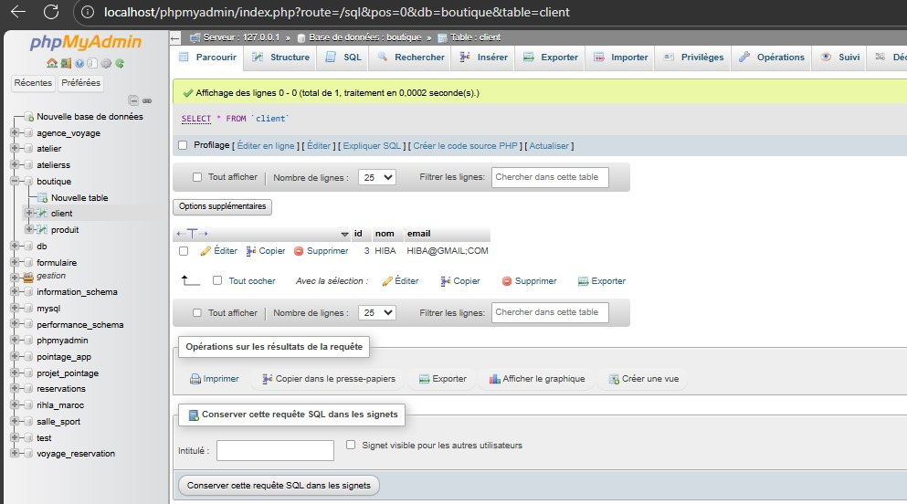
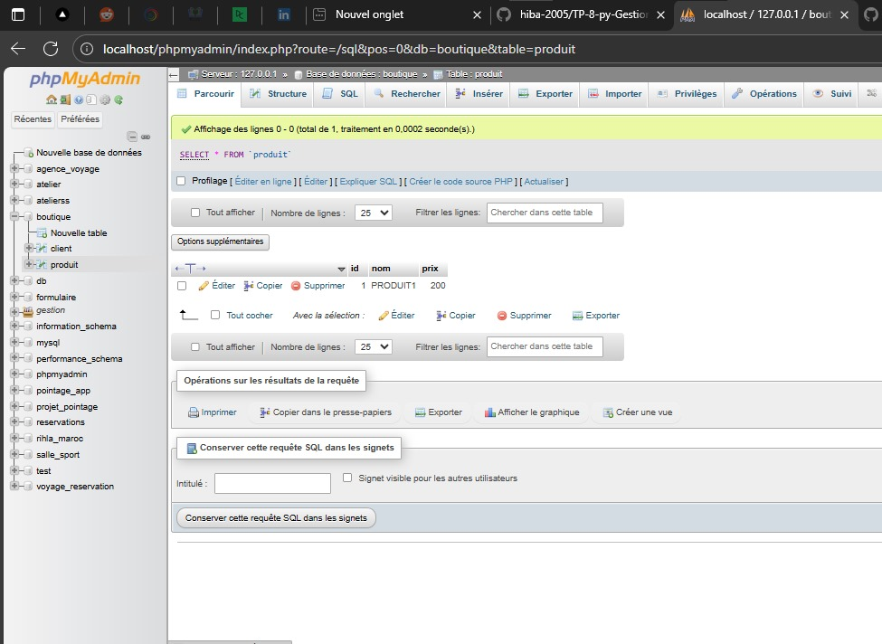
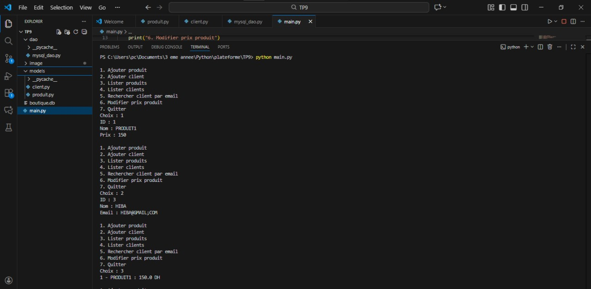
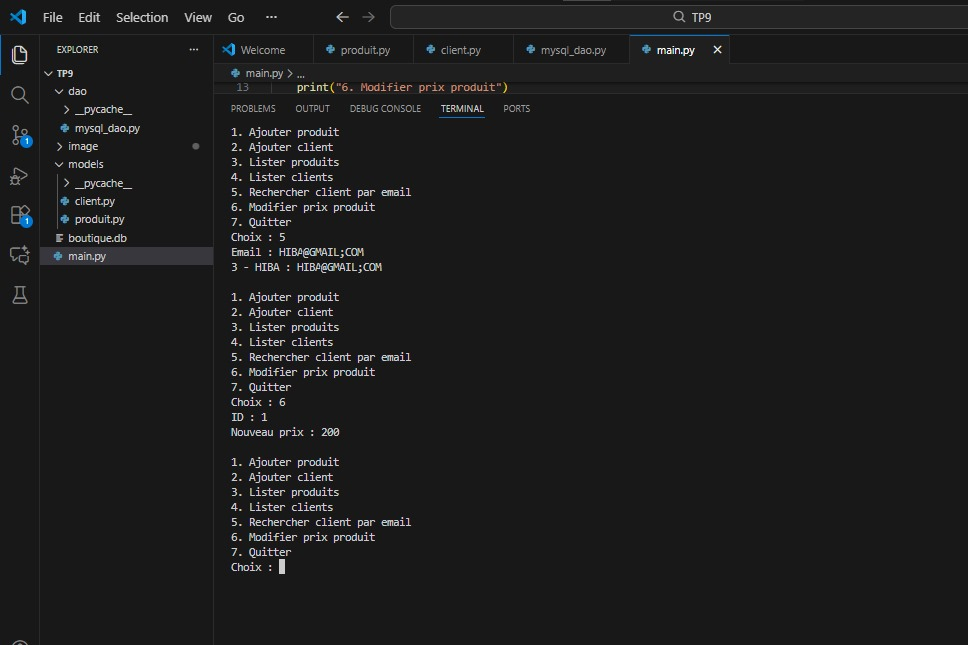

# 📘 TP 9 — Mini-projet Python + MySQL

Programmation Orientée Objet & Accès Base de Données MySQL

## 🎯 Objectif du projet

Développer une mini-application Python utilisant :

la programmation orientée objet (POO) ;

une base de données MySQL (pas de SQLite) ;

le modèle architectural DAO (Data Access Object) pour séparer la logique métier de l’accès aux données.

## 🧱 1. Structure du projet
````
TP9/
│
├── models/
│   ├── produit.py
│   └── client.py
│
├── dao/
│   └── mysql_dao.py      
│
├── main.py               
````
### 📦 2. Classes métier

#### ✔ Produit

Attributs :

id (int)

nom (str)

prix (float)

#### ✔ Client

Attributs :

id (int)

nom (str)

email (str)

Chaque classe possède :

un constructeur

une méthode __str__() pour l’affichage lisible

### 🗄️ 3. Base de données MySQL

Avant d’exécuter le programme, créer la base :

CREATE DATABASE boutique CHARACTER SET utf8mb4;


Aucune table n’est créée manuellement.
Le fichier mysql_dao.py contient :

connexion MySQL via mysql-connector-python

création automatique des tables :

produit

client

## 🧩 Installation du connecteur MySQL pour Python
pip install mysql-connector-python

### 🟦 4. DAO MySQL (mysql_dao.py)

Ce module gère toute la communication avec MySQL :

Ajouter un produit

Ajouter un client

Lister les produits

Lister les clients

Rechercher un client par email

Modifier le prix d’un produit

Toutes les requêtes SQL passent par cette classe, jamais directement depuis main.py.

### 🖥️ 5. Interface utilisateur : main.py

Le fichier main.py fournit un menu CLI interactif :
````
1. Ajouter produit
2. Ajouter client
3. Lister produits
4. Lister clients
5. Rechercher client par email
6. Modifier prix produit
7. Quitter
````

Il utilise exclusivement :
````
from dao.mysql_dao import MySQLDAO
dao = MySQLDAO()
````

### 🧠 6. Fonctionnement général

L’utilisateur choisit une action.

Le programme récupère les valeurs saisies.

main.py appelle les méthodes du DAO MySQL.

Le DAO exécute les requêtes SQL.

Résultat affiché via les méthodes __str__() des classes métier.

### 📝 7. Points forts du projet

Architecture claire : Modèles → DAO → Menu

Séparation stricte entre logique métier et SQL

Base MySQL correctement structurée

Gestion automatique des tables

CRUD complet (Create, Read, Update)

Menu simple et fonctionnel

Code facilement réutilisable ou extensible

### ✔️ 8. Résultat attendu

L’application permet :

d’insérer des produits et clients dans MySQL,

de lister les données,

de rechercher un client par email,

de mettre à jour un prix,

d’interagir via un menu simple dans le terminal.

###  Résultat visuel
<div align="center">  <p><em>Figure 1</em></p> </div>

### Résultat visuel
<div align="center">  <p><em>Figure 2</em></p> </div>

### Résultat visuel
<div align="center">  <p><em>Figure 3</em></p> </div>

### Résultat visuel
<div align="center">  <p><em>Figure 4</em></p> </div>
